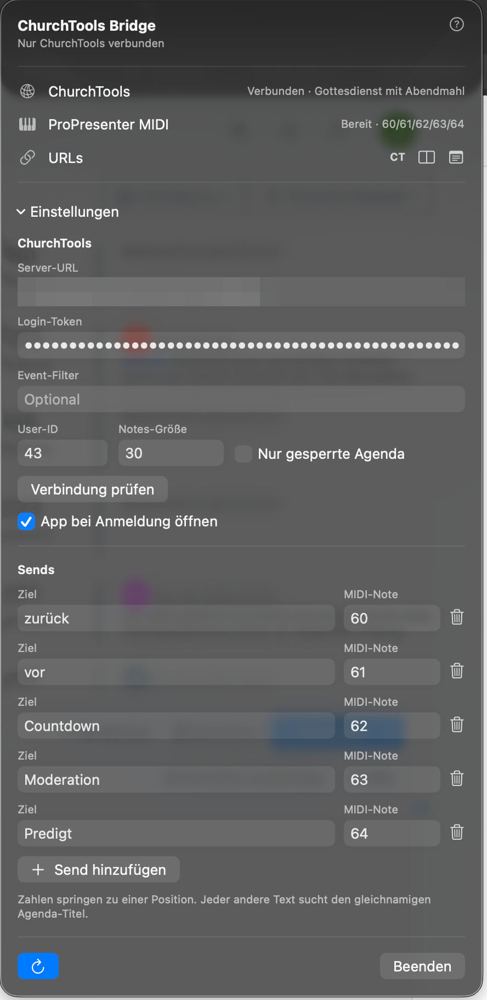

# ChurchTools ProPresenter Bridge

Eine native macOS-Menüleisten-App, die die ChurchTools Live-Agenda per MIDI aus ProPresenter steuert.

```text
ProPresenter MIDI -> ChurchTools Bridge -> ChurchTools Live-Agenda
```



Lokale Anzeige-Ansichten:


## Features

- Virtuelles CoreMIDI-Ziel mit dem Namen `ChurchTools Bridge`
- Frei konfigurierbare MIDI-Sends für zurück, vor, Agenda-Position oder Agenda-Titel
- Automatische Auswahl des nächsten passenden ChurchTools-Events
- Manuelle Event-Auswahl, wenn an einem Tag mehrere passende Agenden vorhanden sind
- Optionale Beschränkung auf gesperrte Agenden
- Kopier-Buttons für die originale ChurchTools Live-Agenda, die kompakte Line-Ansicht und die Notes-Ansicht
- Einstellbare Schriftgröße für die Notes-Ansicht in ProPresenter oder Browser-Sources
- Lokaler Cache und Backoff-Schutz gegen zu viele ChurchTools-API-Anfragen
- Login-Token wird im macOS-Schlüsselbund gespeichert
- Automatischer Bridge-Start beim Öffnen der App und optionaler App-Autostart bei macOS-Anmeldung
- Kopierbares Diagnose-Log, versteckt hinter dreifachem Klick zwischen Restart und Beenden

## Voraussetzungen

- macOS 13 oder neuer
- Eine ChurchTools-Instanz und ein Login-Token
- ProPresenter mit MIDI-Unterstützung
- Für unbeaufsichtigte Anzeigen wird ein eingeschränkter ChurchTools-Funktionsbenutzer empfohlen

## Einrichtung

1. Öffne die App über das Menüleisten-Icon und klappe **Einstellungen** auf.
2. Trage die API-URL ein, zum Beispiel `https://example.church.tools/api`.
3. Trage Login-Token und ChurchTools-User-ID ein.
4. Passe bei Bedarf die MIDI-Sends an.
5. Klicke auf **Verbindung prüfen** und danach auf das Restart-Icon.

Einstellungen werden automatisch gespeichert. Der Login-Token wird im macOS-Schlüsselbund gespeichert und niemals in das Repository oder Diagnose-Log geschrieben. Beim ersten Zugriff kann macOS nach dem Benutzerpasswort fragen, damit `ChurchTools Bridge` den gespeicherten Token lesen darf. Wähle **Immer erlauben**, wenn die App ohne wiederholte Schlüsselbund-Abfragen starten soll.

Der Schalter **App bei Anmeldung öffnen** nutzt den nativen macOS-Login-Item-Dienst. Die Bridge selbst startet beim Öffnen der App automatisch; der Schalter entscheidet nur, ob macOS die App nach der Anmeldung öffnet.

Mit den Buttons `CT`, Line und Notes in der Zeile `URLs` kopierst du die drei lokalen URLs, ohne dass die vollständige Adresse dauerhaft in der Oberfläche steht.

## ProPresenter MIDI

| Send | Standard-Note |
| --- | ---: |
| `zurück` | 60 |
| `vor` | 61 |
| `3` oder ein Agenda-Titel | 62 |

Das Send-Ziel entscheidet, was passiert:

- `zurück`, `previous` oder `back` schaltet die Live-Agenda zurück.
- `vor`, `weiter`, `next` oder `forward` schaltet die Live-Agenda vor.
- Eine Zahl springt zu dieser Agenda-Position.
- Jeder andere Text sucht in der aktuellen Agenda nach einem gleichnamigen Titel und springt dorthin.

Sende MIDI-Note-On-Nachrichten auf Kanal 1 mit Velocity größer als 0. Starte ProPresenter neu, nachdem die Bridge ihren virtuellen MIDI-Port zum ersten Mal erstellt hat.

## Stabile Live-Agenda-URLs

```text
http://127.0.0.1:8765/live
http://127.0.0.1:8765/live/strip
http://127.0.0.1:8765/live/notes
```

Der Server hört nur auf `localhost` und deaktiviert Browser-Caching. `/live` leitet zur ChurchTools Live-Agenda des aktuell gewählten Events weiter und enthält den konfigurierten Login-Token. Nutze diese URL deshalb nur auf einem vertrauenswürdigen Mac mit einem eng eingeschränkten ChurchTools-Funktionsbenutzer.

`/live/strip` rendert eine kompakte lokale Line-Ansicht mit aktuellem und nächstem Agenda-Punkt. `/live/notes` rendert nur die Notizen des aktuellen Agenda-Punkts. Beide Ansichten aktualisieren sich ohne kompletten Seiten-Reload und zeigen den letzten bekannten Stand weiter an, wenn ChurchTools kurzzeitig nicht erreichbar ist.

## ChurchTools Rate Limits

Die lokalen Anzeige-Ansichten sind für ProPresenter-Browser-Sources gedacht. Sie fragen die lokale Bridge ab, nicht ChurchTools direkt. Die Bridge cached den letzten Live-Agenda-Stand, bündelt gleichzeitige lokale Requests und wartet automatisch, wenn ChurchTools mit `429 Too Many Requests` antwortet.

Wenn Rate Limiting auftritt, wechselt der Menüstatus auf `Gedrosselt · Cache aktiv` und das Diagnose-Log protokolliert den Backoff. Die Anzeige-Ansichten nutzen währenddessen weiter den zuletzt gecachten Agenda-Stand.

## Implementierung

Events und Agenden kommen aus der öffentlichen ChurchTools-REST-API. Die Live-Position wird über den Legacy-Endpunkt `churchservice/ajax` mit `loadAgendaLivePosition` und `saveAgendaLivePosition` gesteuert.

## Sicherheit

- Dieses Repository enthält keine ChurchTools-URL, keine Tokens, keine User-IDs, keine Event-IDs und keine personenbezogenen Daten.
- Zugangsdaten werden im macOS-Schlüsselbund mit gerätegebundener Verfügbarkeit gespeichert. Der Zugriff ist durch macOS geschützt und kann eine Freigabe mit dem Benutzerpasswort erfordern.
- Der lokale Weiterleitungsserver hört ausschließlich auf `127.0.0.1`.
- Verwende für den Login-Token einen Funktionsbenutzer mit möglichst wenigen ChurchTools-Rechten.

## Lizenz

Lizenziert unter der [PolyForm Noncommercial License 1.0.0](LICENSE.md). Du darfst die Software für nicht-kommerzielle Zwecke verwenden, verändern und weitergeben. Kommerzielle Nutzung, Weiterverkauf und die Nutzung in einem kommerziellen Produkt oder Dienst sind nicht erlaubt.

Das ist eine source-available Lizenz, keine OSI-anerkannte Open-Source-Lizenz.
