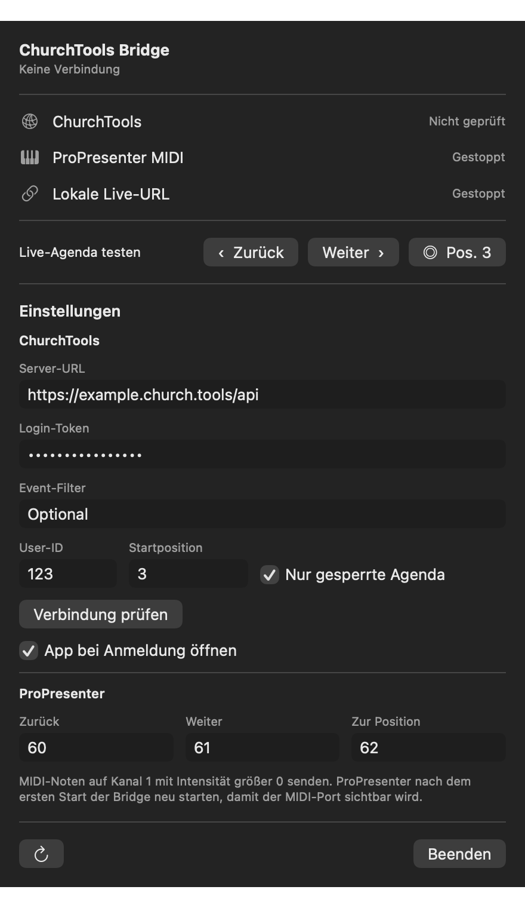

# ChurchTools ProPresenter Bridge

A native macOS menu bar app that controls a ChurchTools Live Agenda from ProPresenter via MIDI.

```text
ProPresenter MIDI -> ChurchTools Bridge -> ChurchTools Live Agenda
```



## Features

- Virtual CoreMIDI destination named `ChurchTools Bridge`
- Previous, next, and configurable agenda-position commands
- Automatic selection of the next matching ChurchTools event
- Optional restriction to locked agendas
- Fixed localhost URL for the currently selected Live Agenda
- Login token stored in macOS Keychain
- Automatic bridge startup whenever the app opens and optional launch at login
- Copyable diagnostic log hidden behind a triple click between Restart and Quit

## Requirements

- macOS 13 or newer
- A ChurchTools instance and login token
- ProPresenter with MIDI support
- A restricted ChurchTools function user is recommended for unattended displays

## Setup

1. Open the menu bar item and expand **Einstellungen**.
2. Enter the API URL, for example `https://example.church.tools/api`.
3. Enter the login token and ChurchTools user ID.
4. Configure the start position and MIDI notes if needed.
5. Click **Verbindung prüfen**, then use the restart icon.

Settings are saved automatically. The login token is stored in Keychain and is never written to the repository or diagnostic log.

The **App bei Anmeldung öffnen** switch uses the native macOS login-item service. The bridge itself starts whenever the app opens; the switch only controls whether macOS opens the app after login.

## ProPresenter MIDI

| Action | Default note |
| --- | ---: |
| Previous | 60 |
| Next | 61 |
| Go to configured position | 62 |

Send MIDI Note On messages on channel 1 with velocity greater than zero. Restart ProPresenter after the bridge first creates its virtual MIDI port.

## Stable Live Agenda URL

```text
http://127.0.0.1:8765/live
```

The server binds to localhost only and disables caching. The redirect includes the configured login token, so use it only on a trusted Mac with a tightly restricted ChurchTools function user.

## Build

```sh
DEVELOPER_DIR=/Applications/Xcode.app/Contents/Developer ./scripts/build-app.sh
open ".build/ChurchTools Bridge.app"
```

The script creates `.build/ChurchTools Bridge.app` and `.build/dist/ChurchTools Bridge.zip`. Without a Developer ID it uses an ad-hoc signature. For trusted distribution and notarization:

```sh
CODE_SIGN_IDENTITY="Developer ID Application: Your Name (TEAMID)" \
NOTARY_PROFILE="churchtools-bridge" \
DEVELOPER_DIR=/Applications/Xcode.app/Contents/Developer \
./scripts/build-app.sh
```

## Implementation Notes

The public ChurchTools REST API supplies events and agendas. Live position is controlled through the legacy `churchservice/ajax` endpoint using `loadAgendaLivePosition` and `saveAgendaLivePosition`.

## Security

- No ChurchTools URL, token, user ID, event ID, or personal data is included in this repository.
- Secrets are stored in macOS Keychain with device-only accessibility.
- The redirect server only listens on `127.0.0.1`.
- Use a function user with the smallest possible set of ChurchTools permissions.

## License

Licensed under the [PolyForm Noncommercial License 1.0.0](LICENSE.md). You may use, modify, and redistribute the software for noncommercial purposes. Commercial use, resale, and use in a commercial product or service are not permitted.

This is a source-available license, not an OSI-approved open-source license.
