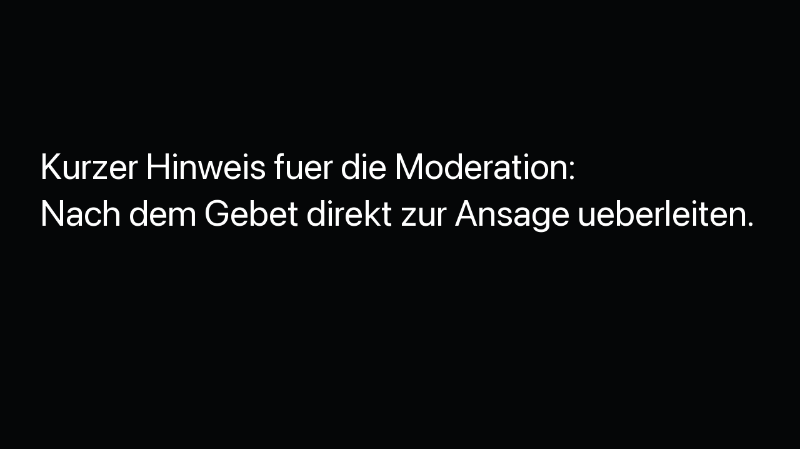

# ChurchTools ProPresenter Bridge

A native macOS menu bar app that controls a ChurchTools Live Agenda from ProPresenter via MIDI.

```text
ProPresenter MIDI -> ChurchTools Bridge -> ChurchTools Live Agenda
```


Local display views:




## Features

- Virtual CoreMIDI destination named `ChurchTools Bridge`
- Configurable MIDI sends for previous, next, agenda position, or agenda title
- Automatic selection of the next matching ChurchTools event, with manual choice when multiple matching agendas exist on the same day
- Optional restriction to locked agendas
- Copy buttons for the original ChurchTools Live Agenda, compact line view, and notes view
- Adjustable notes font size for ProPresenter/browser embeds
- Local cache and backoff protection to reduce ChurchTools API requests
- Login token stored in macOS Keychain
- Automatic bridge startup whenever the app opens and optional launch at login
- Copyable diagnostic log hidden behind a triple click between Restart and Quit

## Requirements

- macOS 13 or newer
- A ChurchTools instance and login token
- ProPresenter with MIDI support
- A restricted ChurchTools function user is recommended for unattended displays

## Setup

1. Open the menu bar item and expand **Einstellungen**.
2. Enter the API URL, for example `https://example.church.tools/api`.
3. Enter the login token and ChurchTools user ID.
4. Configure the MIDI sends if needed.
5. Click **Verbindung prüfen**, then use the restart icon.

Settings are saved automatically. The login token is stored in the macOS Keychain and is never written to the repository or diagnostic log. On first use, macOS may ask for the user's login password to allow `ChurchTools Bridge` to read the saved token. Choose **Always Allow** if the app should start without repeated Keychain prompts.

The **App bei Anmeldung öffnen** switch uses the native macOS login-item service. The bridge itself starts whenever the app opens; the switch only controls whether macOS opens the app after login.

Use the `CT`, line, and notes buttons in the `URLs` row to copy the three local URLs without exposing the full address in the interface.

## ProPresenter MIDI

| Send | Default note |
| --- | ---: |
| `zurück` | 60 |
| `vor` | 61 |
| `3` or any agenda title | 62 |

The send target decides what happens:

- `zurück`, `previous`, or `back` moves the Live Agenda back.
- `vor`, `weiter`, `next`, or `forward` moves it forward.
- A number jumps to that agenda position.
- Any other text searches the current agenda for a matching title and jumps there.

Send MIDI Note On messages on channel 1 with velocity greater than zero. Restart ProPresenter after the bridge first creates its virtual MIDI port.

## Stable Live Agenda URL

```text
http://127.0.0.1:8765/live
http://127.0.0.1:8765/live/strip
http://127.0.0.1:8765/live/notes
```

The server binds to localhost only and disables caching. `/live` redirects to the ChurchTools Live Agenda and includes the configured login token, so use it only on a trusted Mac with a tightly restricted ChurchTools function user.

`/live/strip` renders a compact local line view with the current and next agenda item. `/live/notes` renders only the notes for the current item. Both update without a full page reload and keep rendering the last known state if ChurchTools is temporarily unavailable.

## ChurchTools Rate Limits

The local display views are designed for ProPresenter browser sources. They poll the local bridge, not ChurchTools directly. The bridge caches the latest live agenda snapshot, shares simultaneous local requests, and waits before retrying if ChurchTools responds with `429 Too Many Requests`.

If rate limiting happens, the menu status changes to `Gedrosselt · Cache aktiv` and the diagnostic log records the backoff. The display views continue using the most recent cached agenda state.

## Build

```sh
DEVELOPER_DIR=/Applications/Xcode.app/Contents/Developer ./scripts/build-app.sh
open ".build/ChurchTools Bridge.app"
```

The script creates `.build/ChurchTools Bridge.app` and `.build/dist/ChurchTools Bridge.zip`. Without a Developer ID it uses an ad-hoc signature. For trusted distribution and notarization:

```sh
CODE_SIGN_IDENTITY="Developer ID Application: Your Name (TEAMID)" \
NOTARY_PROFILE="churchtools-bridge" \
DEVELOPER_DIR=/Applications/Xcode.app/Contents/Developer \
./scripts/build-app.sh
```

## Implementation Notes

The public ChurchTools REST API supplies events and agendas. Live position is controlled through the legacy `churchservice/ajax` endpoint using `loadAgendaLivePosition` and `saveAgendaLivePosition`.

## Security

- No ChurchTools URL, token, user ID, event ID, or personal data is included in this repository.
- Secrets are stored in the macOS Keychain with device-only accessibility. Access is protected by macOS and may require approval with the user's login password.
- The redirect server only listens on `127.0.0.1`.
- Use a function user with the smallest possible set of ChurchTools permissions.

## License

Licensed under the [PolyForm Noncommercial License 1.0.0](LICENSE.md). You may use, modify, and redistribute the software for noncommercial purposes. Commercial use, resale, and use in a commercial product or service are not permitted.

This is a source-available license, not an OSI-approved open-source license.
